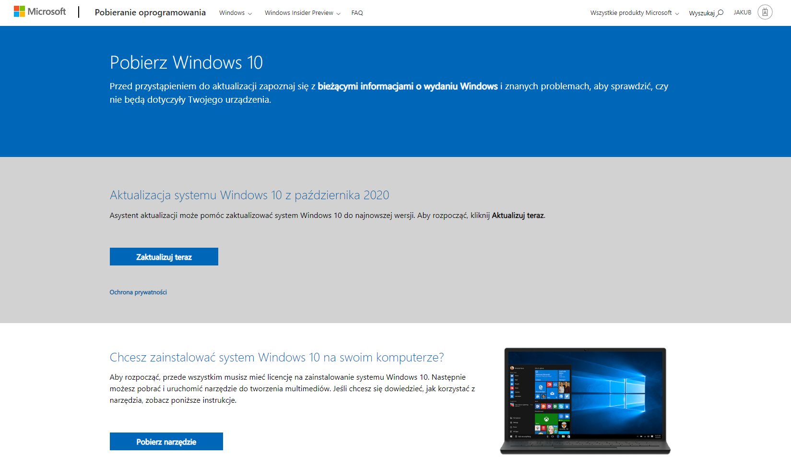
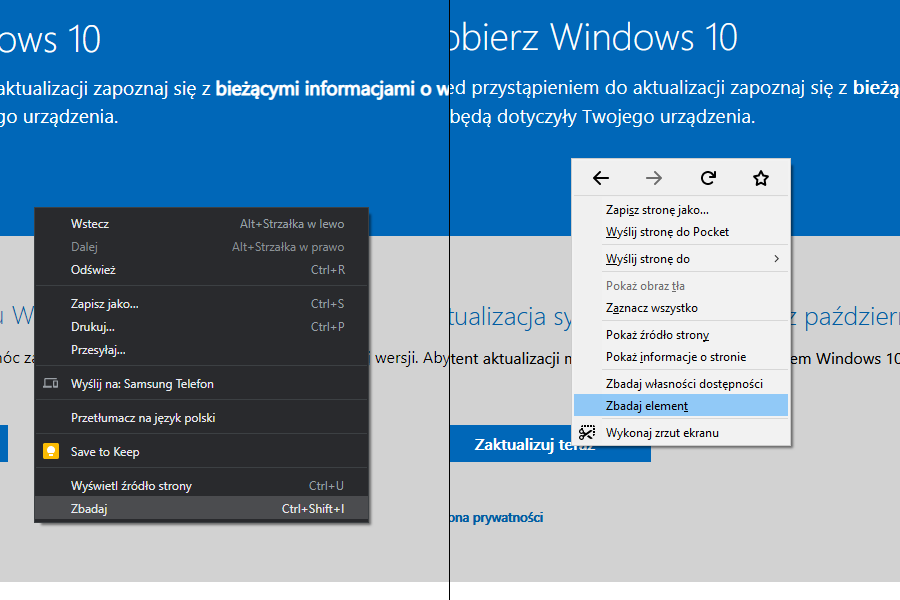
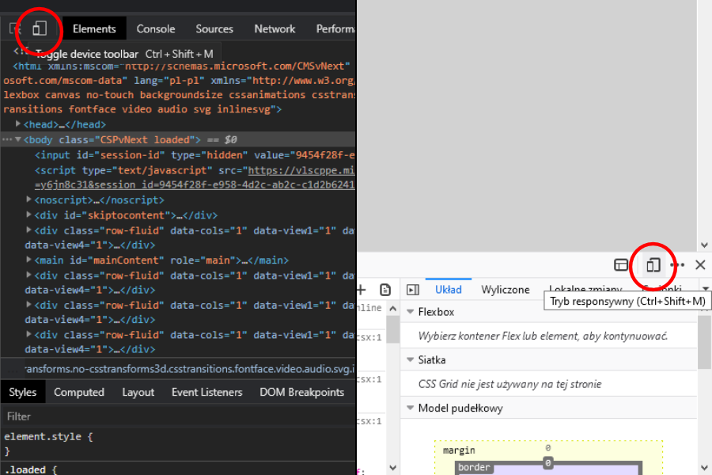
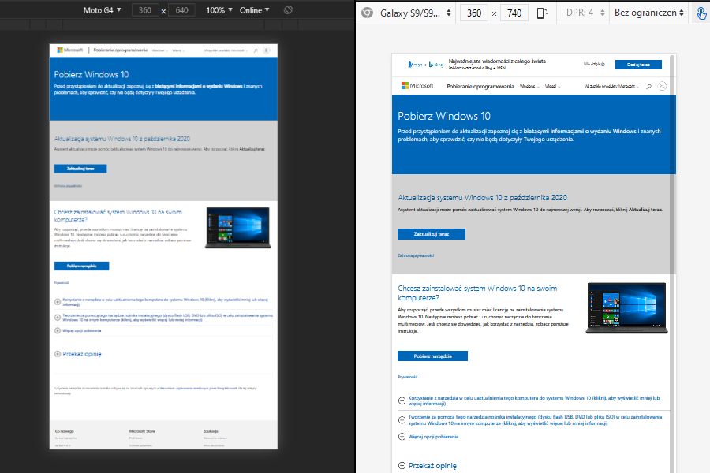
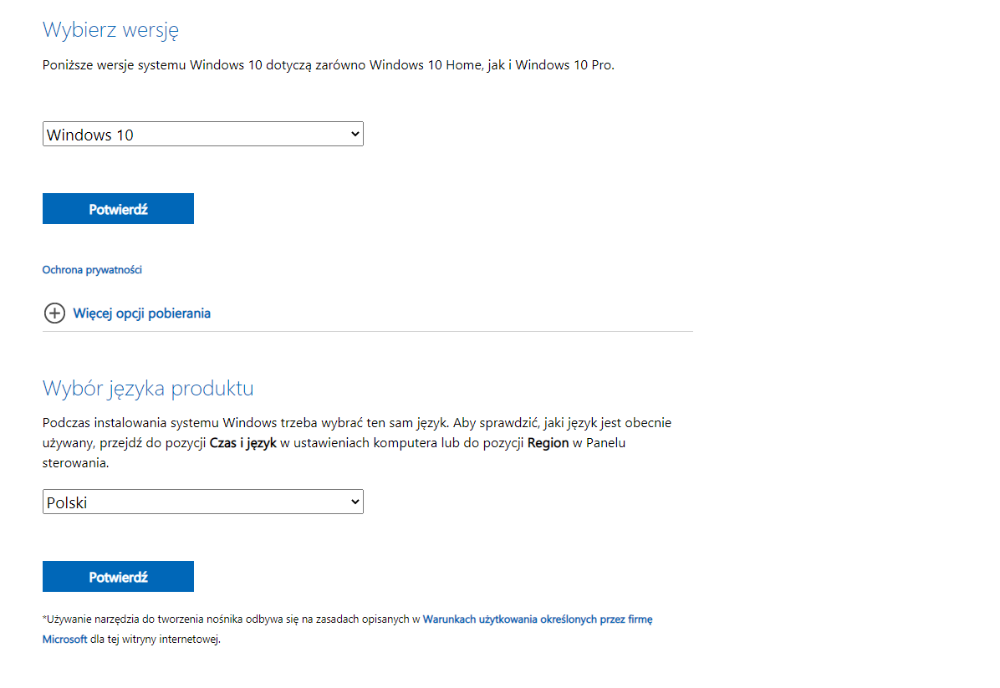
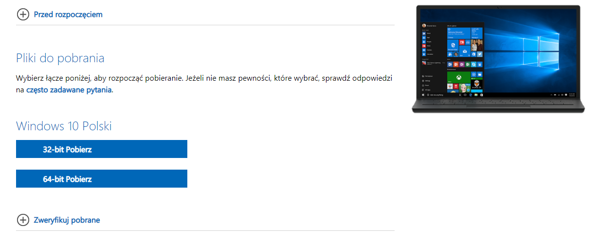

W tym poradniku pokażę Ci skąd i w jaki sposób pobrać plik ISO z obrazem systemu Windows 10. Będzie on nam potrzebny do zainstalowania Windowsa.

## Krok 1 - Źródło

W celu pobrania wspomnianego wyżej pliku musimy przejść na stronę Microsoftu.

```
https://www.microsoft.com/pl-pl/software-download/windows10
```

Naszym oczom ukaże się mniej więcej coś takiego:



Po głębszej analizie zawartości strony widzimy, że niestety nie ma opcji pobrania pliku ISO bez pobierania narzędzia Microsoftu. Jak sobie z tym poradzić?

## Krok 2 - Narzędzia developerskie

Klikamy prawym przyciskiem myszki w dowolnym miejscu na stronie, a następnie w menu kontekstowym wybieramy opcję **Zbadaj** (Chrome) / **Zbadaj Element** (Firefox).



W obu przypadkach możemy również użyć klawisza **F12**, będzie to miało taki sam skutek.
W ten sposób otwieramy narzędzia developerskie przeglądarki. Niech nazwa Cię nie przestraszy. Tutaj nic nie zepsujesz!

## Krok 3 - Tryb telefonu

Aby umożliwić pobranie pliku ISO musimy udać, że korzystamy z urządzenia mobilnego. W tym celu, po otwarciu narzędzi developerskich, szukamy ikonki telefonu i tabletu.



Naszym oczom ukaże się mniej więcej coś takiego:



Teraz wystarczy, że odświeżymy stronę i już mamy możliwość pobrania pliku ISO.
(Jeśli strona nie otwiera się w wersji mobilnej upewnij się, że ustawione jest urządzenie mobilne np. Galaxy S9).

Teraz możemy wyłączyć już tryb telefonu i narzędzia developerskie.

## Krok 4 - Pobieranie ISO

Teraz wybieramy najnowszą wersję Windowsa 10 oraz język systemu. Nasze wybory potwierdzamy przyciskiem **Potwierdź**.



Czekamy chwilę, następnie klikamy przycisk **64-bit Pobierz**



Wskazujemy miejsce, gdzie ma pobrać się nasz plik i voilà! Mamy plik ISO. W następnym poradniku pokażę Ci jak stworzyć bootowalny pendrive, czyli taki, który pozwoli nam na instalację systemu na naszym komputerze lub laptopie.
