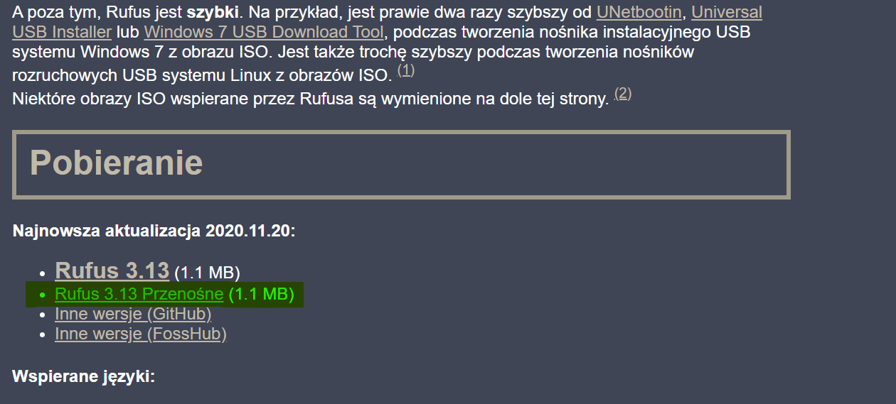
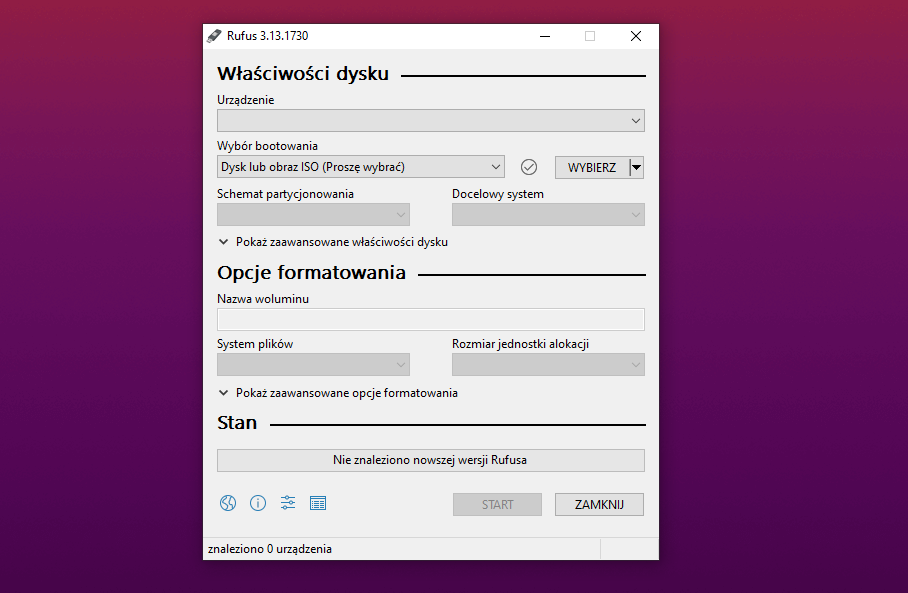
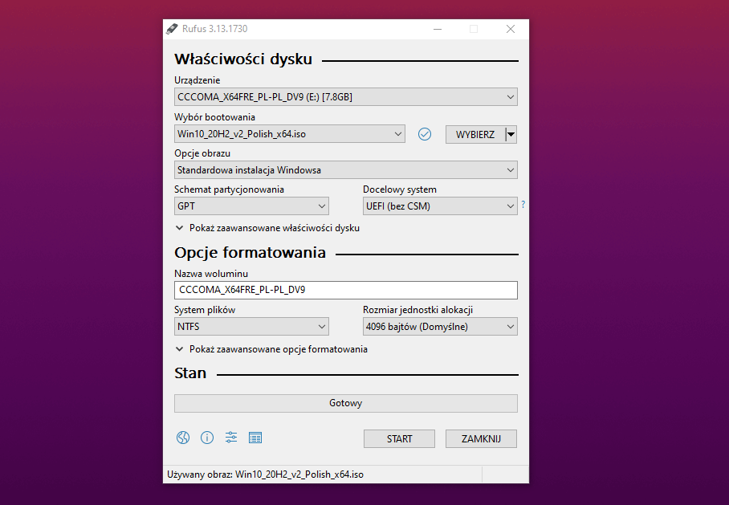

W tym poradniku pokażę Ci jak w prosty i łatwy sposób stworzyć pendrive, dzięki któremu będziemy mogli zainstalować system na komputerze lub laptopie.

## Krok 1 - Plik ISO

Aby zainstalować system z pendrive'a oczywiście będziemy potrzebować samego systemu, a dokładniej pliku ISO z instalatorem. W [tym poradniku](/posty/jak-pobrac-obraz-systemu-windows-10) pokazuje jak pobrać plik ISO dla Windowsa 10.

## Krok 2 - Program Rufus

Jak podaje oficjalna strona programu:

***"Rufus to narzędzie pomagające formatować i tworzyć nośniki rozruchowe USB, takie jak dyski flash USB/pendrive, karty pamięci itp."***

To jest właśnie to czego potrzebujemy.
W celu pobrania Rufusa przechodzimy na stronę:

```
https://rufus.ie/
```

Przechodzimy niżej do sekcji **Pobieranie** i klikamy na **Rufus 3.xx Przenośne** (3.xx to numer wersji, w momencie pisania tego poradnika jest to wersja 3.13).



Zapisujemy plik np. na pulpicie i uruchamiamy go po pobraniu.

Naszym oczom ukaże się coś takiego:



## Krok 3 - Tworzymy pendrive'a

Oczywiście będziemy potrzebować **pendrive'a o pojemności minimum 4GB**.

**Uwaga! Wszystkie dane z tego nośnika zostaną usunięte, więc upewnij się że nie masz na nim żadnych ważnych plików.**

Podłączamy go do komputera / laptopa, najlepiej bezpośrednio bez żadnych przedłużek czy hubów USB.

Na samej górze w sekcji **Urządzenie** wybieramy naszego pendrive'a.

Następnie w sekcji **Wybór bootowania** klikamy przycisk **WYBIERZ** po prawej stronie. W nowo otwartym oknie wskazujemy nasz plik ISO, w tym przypadku plik z Windowsem.

Rufus automatycznie dostosuje ustawienia pod wybrany obraz systemu. 

Tak powinien teraz wyglądać stan naszego programu:



Jedyne co musimy teraz zrobić to kliknięcie przycisku **START** w prawym dolnym rogu.

Wyskakujące ostrzeżenia potwierdzamy i czekamy, aż program ukończy swoją pracę.

**Jeśli zamierzasz instalacje Windowsa na starszym sprzęcie, który nie obsluguje [UEFI](https://pl.wikipedia.org/wiki/Unified_Extensible_Firmware_Interface) - w sekcji *Schemat partycjonowania* wybierz opcję *MBR*.**

No i już! Nasz pendrive jest gotowy. W następnym poradniku pokażę Ci jak wykorzystać go do instalacji Windowsa na komputerze lub laptopie.
